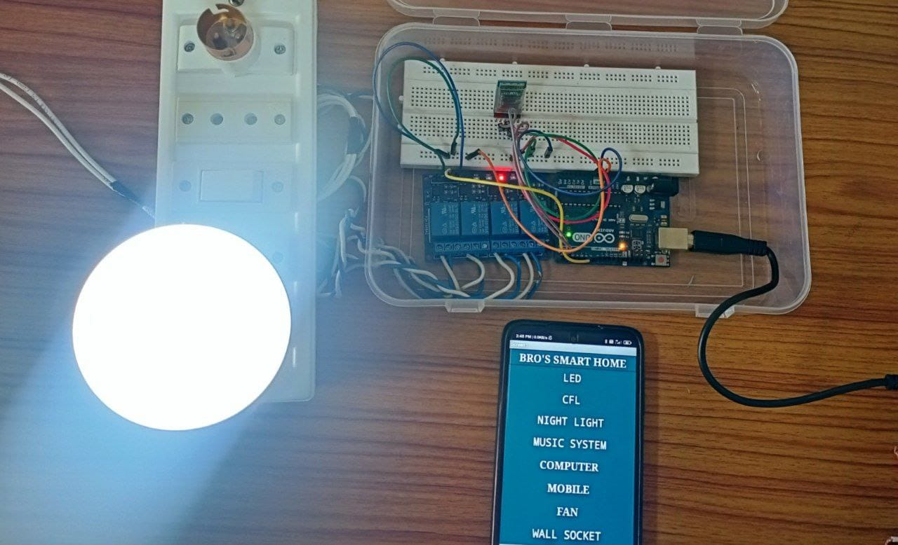
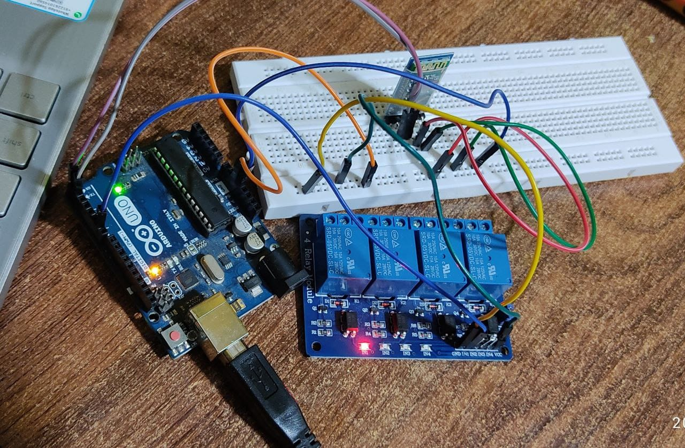

# Bluetooth-Based Home Automation using Arduino UNO

  
  

## Overview
Designed and implemented a Bluetooth-controlled home automation system using Arduino UNO and HC-05. Enables wireless ON/OFF control of AC appliances via an Android application.

## System Architecture
Smartphone App → HC-05 (UART @ 9600 bps) → Arduino UNO → 4-Channel Relay → AC Loads

## Key Features
- Wireless appliance control (up to 4 loads)
- UART serial communication
- Relay-based AC switching with isolation
- Low-cost embedded solution

## Hardware Used
- Arduino UNO
- HC-05 Bluetooth Module
- 4-Channel Relay Module
- AC Bulb/Fan
- 5V Power Supply

## Working
- App sends character commands via Bluetooth.
- Arduino reads serial input.
- GPIO pins toggle relay states.
- Relay switches AC appliances ON/OFF.

## Code
`Arduino_Code/home_automation.ino`

## Future Improvements
- Wi-Fi (ESP8266/ESP32) integration
- Energy monitoring
- Cloud dashboard
